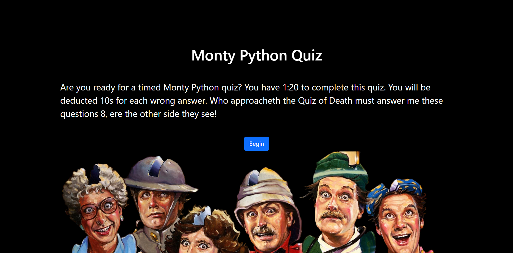
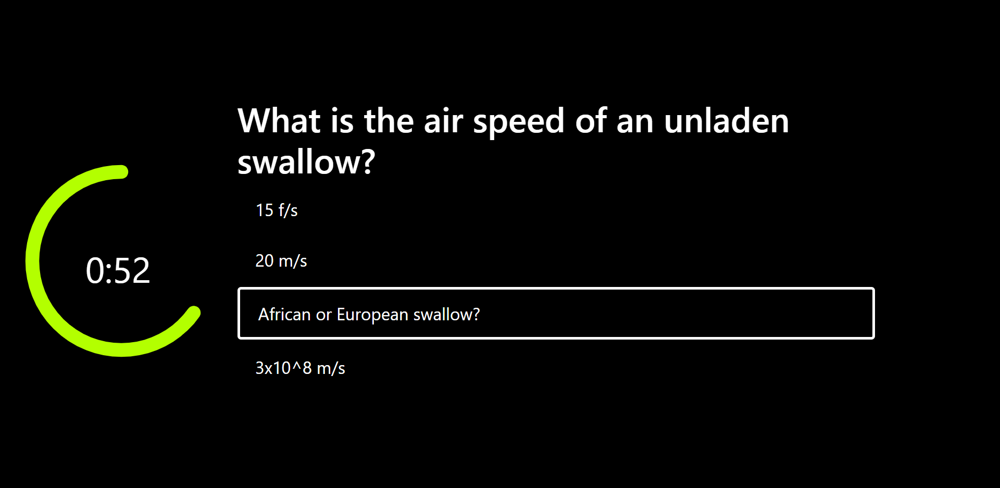
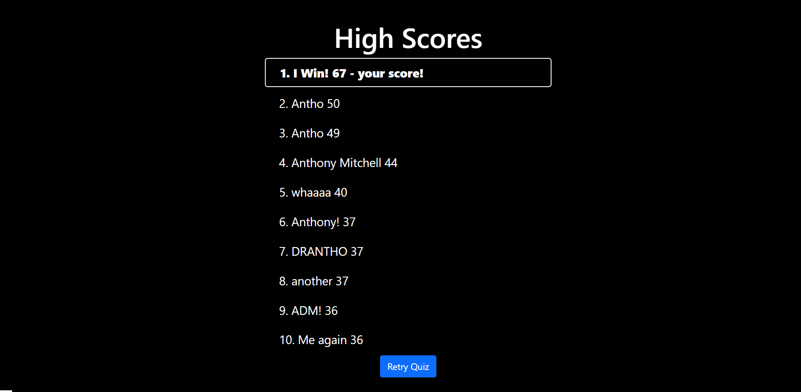

# QuizApp
UW Bootcamp week 3 homework

This app features a timed quiz. The user is presented with a series of Monty Python themed questions and a limited time to complete it.

---------------------------------------------------------------------------------------------------------------------------------
## Features

- The questions are taken from an array variable in the script file. 
- The user is given (10 * number of questions) seconds to complete the quiz. 
- Questions are displayed to the user one at a time.
- A digital timer and a circular indicator for the % time they have remaining are also displayed. 
- Circular time indicator fades from green to red.
- When the user selects a correct answer, the timer flashes green. 
- When the user selects an incorrect answer, the timer flashes red. 
- The user has 10 seconds deducted from their time remaining each time they answer incorrectly. 
- At 0 seconds left, or when the quiz is complete, the user receives a score equal to their remaining time. 
- The top 10 results are stored in localStorage. 
- After each round, the user is shown the high score list in order of scores.
- User's score is highlighted if they made it on the list.
- Retry button.
-------------------------------------------------------------------------------------------------------------------------------
## Screen shots


### Welcome/landing screen


### Quiz screen


### High score screen


---------------------------------------------------------------------------------------------------------------------------------
## Assignment

# 04 Web APIs: Code Quiz

## Your Task

As you proceed in your journey to becoming a full-stack web developer, it’s likely that you’ll be asked to complete a coding assessment, perhaps as part of an interview process. A typical coding assessment is a combination of multiple-choice questions and interactive coding challenges. 

To help you become familiar with these tests and give you a chance to apply the skills from this module, this week’s homework invites you to build a timed coding quiz with multiple-choice questions. This app will run in the browser, and will feature dynamically updated HTML and CSS powered by JavaScript code that you write. It will have a clean, polished, and responsive user interface. This week’s coursework will teach you all the skills you need to succeed in this assignment.


## User Story

```
AS A coding boot camp student
I WANT to take a timed quiz on JavaScript fundamentals that stores high scores
SO THAT I can gauge my progress compared to my peers
```


## Acceptance Criteria

```
GIVEN I am taking a code quiz
WHEN I click the start button
THEN a timer starts and I am presented with a question
WHEN I answer a question
THEN I am presented with another question
WHEN I answer a question incorrectly
THEN time is subtracted from the clock
WHEN all questions are answered or the timer reaches 0
THEN the game is over
WHEN the game is over
THEN I can save my initials and score
```


## Mock-Up

The following animation demonstrates the application functionality:


## Grading Requirements

This homework is graded based on the following criteria: 

### Technical Acceptance Criteria: 40%

* Satisfies all of the above acceptance criteria.

### Deployment: 32%

* Application deployed at live URL.

* Application loads with no errors.

* Application GitHub URL submitted.

* GitHub repository that contains application code.

### Application Quality: 15%

* Application user experience is intuitive and easy to navigate.

* Application user interface style is clean and polished.

* Application resembles the mock-up functionality provided in the homework instructions.

### Repository Quality: 13%

* Repository has a unique name.

* Repository follows best practices for file structure and naming conventions.

* Repository follows best practices for class/id naming conventions, indentation, quality comments, etc.

* Repository contains multiple descriptive commit messages.

* Repository contains quality README file with description, screenshot, and link to deployed application.


## Review

You are required to submit BOTH of the following for review:

* The URL of the functional, deployed application.

* The URL of the GitHub repository. Give the repository a unique name and include a README describing the project.

- - -
© 2020 Trilogy Education Services, a 2U, Inc. brand. All Rights Reserved.

